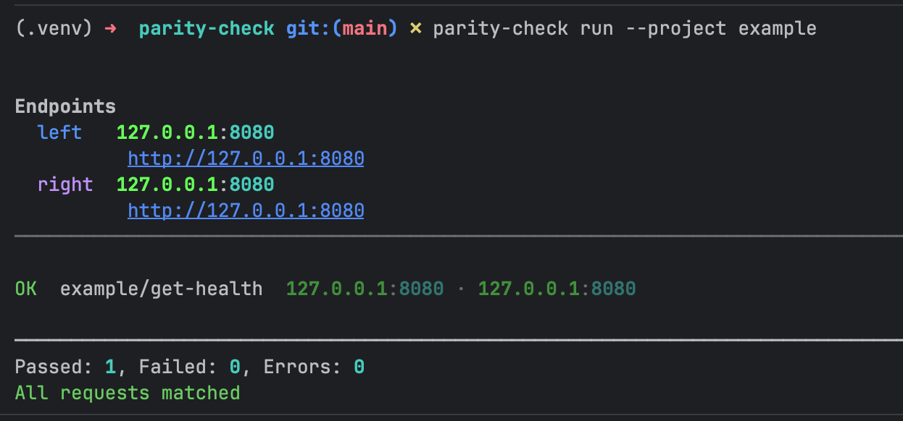
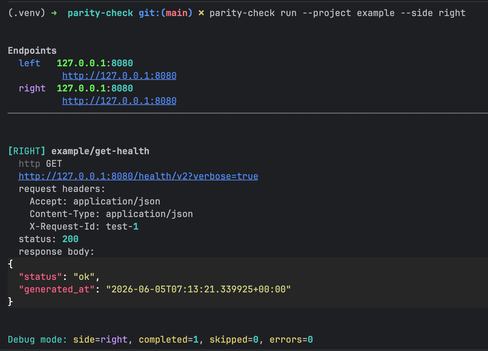
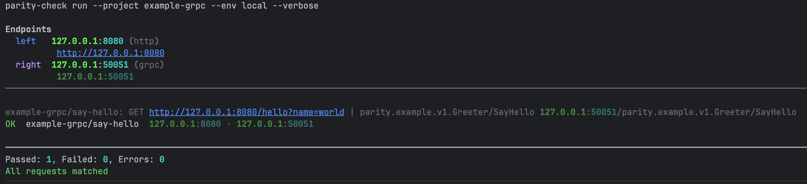
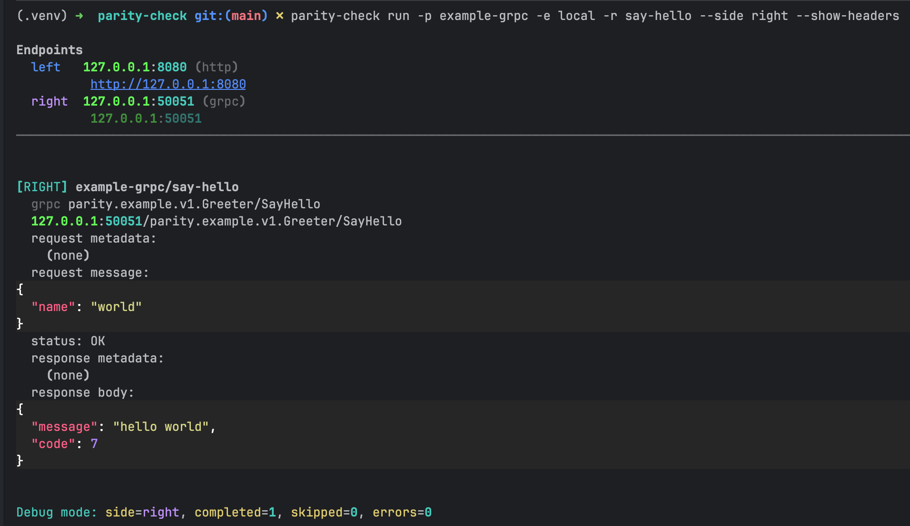

# Getting started

Install parity-check, run the bundled demos, and see a green **OK** in under five minutes. You only need a terminal and Python 3.11+ installed on your system.

## Install

Choose one method.

### Option A — virtual environment (recommended for development)

```bash
git clone <repository-url> parity-check
cd parity-check
python3 -m venv .venv
source .venv/bin/activate          # Windows: .venv\Scripts\activate
pip install -e ".[dev]"
parity-check --help
```

### Option B — pipx (global CLI, no venv)

```bash
pipx install /path/to/parity-check
# or after publish: pipx install parity-check
parity-check --help
```

Verify: `parity-check list` should print available projects (`example`, `example-grpc`, …).

## What gets installed?

| Piece | Purpose |
|-------|---------|
| `parity-check` command | Compare APIs from the terminal |
| YAML under `projects/` | Your test definitions (you edit these, not Python) |
| Python packages | Runtime for HTTP (httpx) and gRPC (grpcio) — you do not import them |

## Demo 1 — HTTP vs HTTP (`example`)

Compares two URLs on **one host** (`127.0.0.1:8080`) with different paths: `/health/legacy` (left) and `/health/v2` (right).

**Terminal 1** — start the demo server:

```bash
source .venv/bin/activate
python projects/example/demo_servers.py
```

**Terminal 2** — run the comparison:

```bash
source .venv/bin/activate
parity-check run --project example --env local --verbose
```

Expected result:



Both endpoints point to the same address; paths differ via `left.path` / `right.path` in [projects/example/requests/get-health.yaml](../projects/example/requests/get-health.yaml). Field `generated_at` is ignored via `ignore_paths`.

### Debug one side (no comparison)

Inspect only the right endpoint:

```bash
parity-check run --project example --env local --request get-health --side right
```



## Demo 2 — HTTP vs gRPC (`example-grpc`)

Compares HTTP on the left (`127.0.0.1:8080`) with gRPC on the right (`127.0.0.1:50051`) — a typical API migration check.

**Terminal 1**:

```bash
source .venv/bin/activate
python projects/example-grpc/demo_servers.py
```

**Terminal 2**:

```bash
source .venv/bin/activate
parity-check run --project example-grpc --env local --verbose
```

Expected result:



The request YAML defines HTTP fields for the left side and a `grpc` block for the right. Proto contract lives in [projects/example-grpc/proto/](../projects/example-grpc/proto/).

### Debug the gRPC side

```bash
parity-check run -p example-grpc -e local -r say-hello --side right --show-headers
```



## Next steps

1. Read [Concepts](concepts.md) — left/right, projects, environments
2. Copy `projects/example/` to `projects/my-api/` and point `base.left` / `base.right` at your services
3. Use [Request schema](request-schema.md) when authoring new `requests/*.yaml`
4. Wire into CI — [Deployment](deployment.md)

## Troubleshooting

| Symptom | Likely cause | Fix |
|---------|----------------|-----|
| `Connection refused` | Demo server not running | Start `demo_servers.py` in another terminal |
| gRPC `UNIMPLEMENTED` on `localhost` | IPv6 vs IPv4 | Use `127.0.0.1` in `base` (already set in `env/local.yaml`) |
| `Undefined variable: ${FOO}` | Missing var | Add to `env/*.yaml` `vars` or pass `--var FOO=value` |
| `proto directory not found` | gRPC without `.proto` | Add files under `projects/<name>/proto/` |
| Exit `2` on `list` | Wrong working directory | Run from repo root or pass `--projects-dir` |
